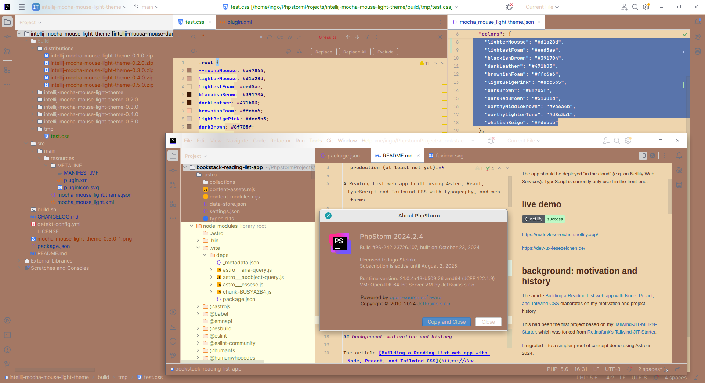
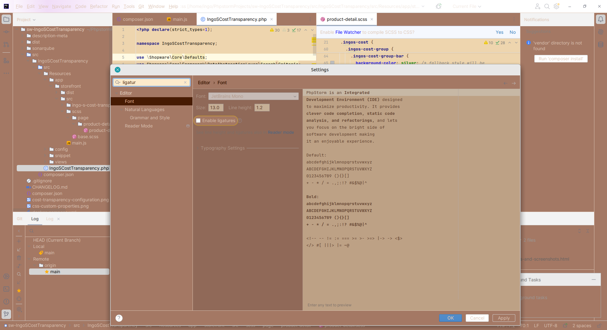
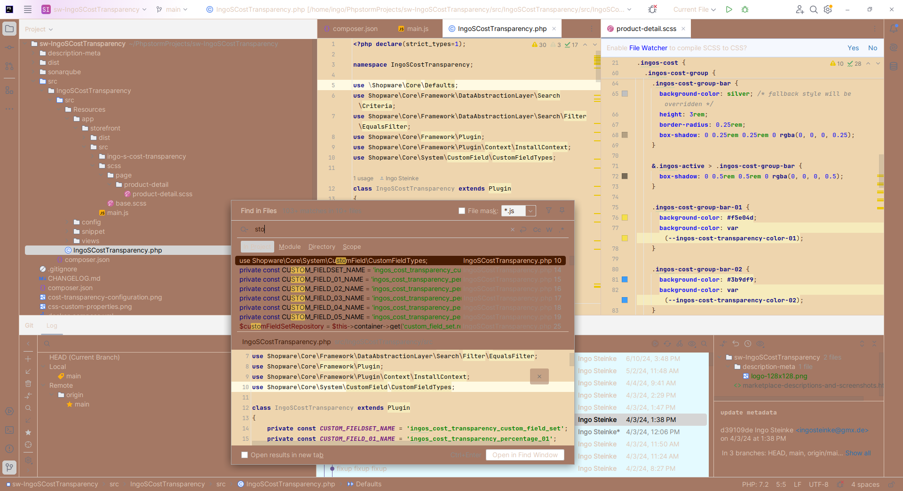
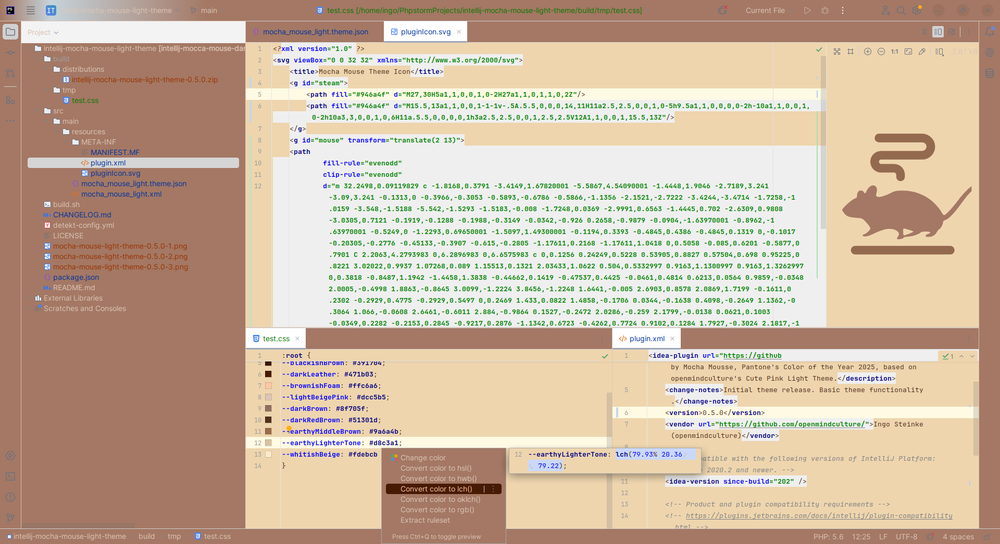

# intellij-mocha-mouse-light-theme

[Mocha Mouse Light Theme](https://plugins.jetbrains.com/plugin/26136-mocha-mouse-light-theme/) is another colorful light theme for PhpStorm and other IntelliJ-based IDEs, inspired by Mocha Mousse, Pantone's color of the year 2025, based on openmindculture's Cute Pink light theme.

**BETA: This theme is usable, but still unfinished!**

If you like to support development, you can open a pull request [on GitHub](https://github.com/openmindculture/intellij-mocha-mouse-light-theme).

For JetBrains IDEs, version 2020.2 and above. Tested up to 2024.2.4 (242). It will probably work on older builds like 2019.1 as well, but untested.

To install:
- Go to Settings (Preferences) | Plugins, find the theme plugin and install it
- _or_ download from JetBrains Plugins page: https://plugins.jetbrains.com/plugin/26136-mocha-mouse-light-theme/
- Restart IDE(A)
- Go to Settings (Preferences) | Appearance & Behavior | Appearance and see the Theme dropdown
  [Report an issue](https://github.com/openmindculture/intellij-mocha-mouse-light-theme/issues/new) | [on GitHub](https://github.com/openmindculture/intellij-mocha-mouse-light-theme).
<!-- Plugin description end -->

If you only want to install the theme, you do not need this repository.
You can install the theme from JB marketplace (inside your IDE) or install zip file (see below).

### Screenshot

### Local Installation

In `build/distributions` there is a zip file that I can manually import into my regular PhpStorm installation (Settings -> Plugins -> Gear Icon -> install plugin from disk).

### Development

Update colors, increase version number, and rebuild the theme.

#### Shell Build (beta)

`npm run build`

- requires `bash`/`sh`!
- creates a `build/distributions/intellij-mocha-mouse-light-theme-x.y.z.zip`